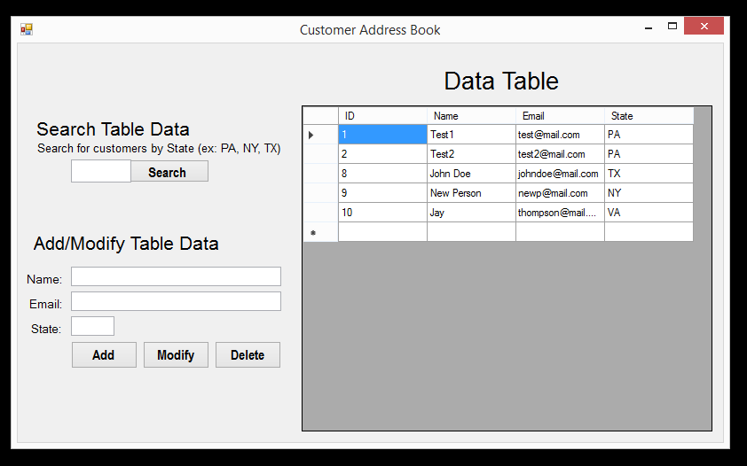
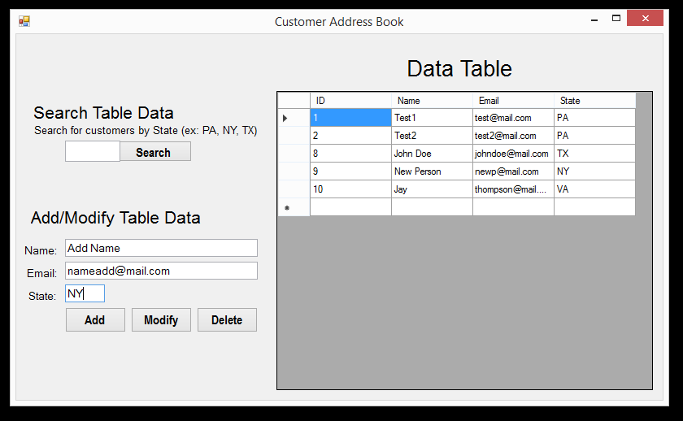

<h1>Customer Address Book</h1>

<h3>Background</h3>

Story:  
  "As a salesperson, I want a customer information management system so that I can market products based on a region's demand."  
Acceptance Criteria:  
  1. The system can display information in a UI.  
  2. The system can connect to information in a database.  
  3. The system can add new information.  
  4. The system can modify existing information.  
  5. The system can delete information.  
  6. The system can sort information based on State locations.  

<h3>How it works:</h3>

This customer address book works by using a server to connect to a SQL database. Using queries, it displays query results in an interface.
  

Home Display View (shows maximum records allowable by default)  
  

Searching (conducts search based on State information put in by user)  
  

Search Conducted (displays sorted table results)  
  

Adding Data (if all fields are not null, then a new record is added)  
  

Data Added  
  

Similar to the "Add" function, a record can be changed by double clicking the displayed row of interest in the UI. This fills the Name, Email, and State fields with that data. After changing the data in the field and clicking the "Modify" button, a message box will confirm the update and the changes will be shown in the display. A record can be completely deleted by following the same instructions for the modifying option, but by clicking "Delete" instead of "Modify". 
